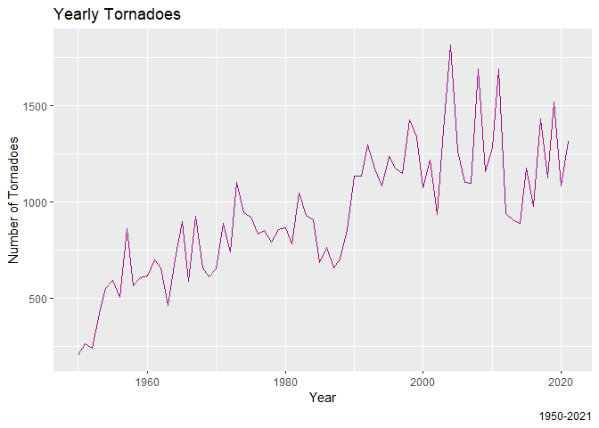
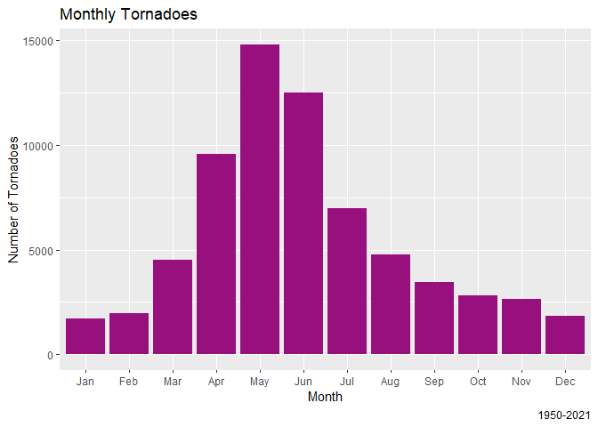
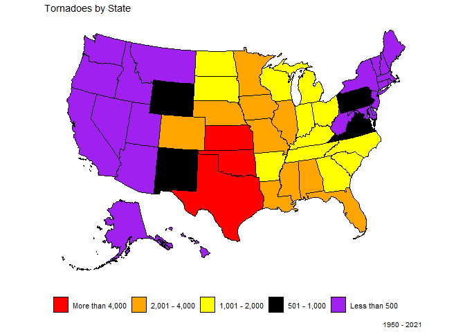
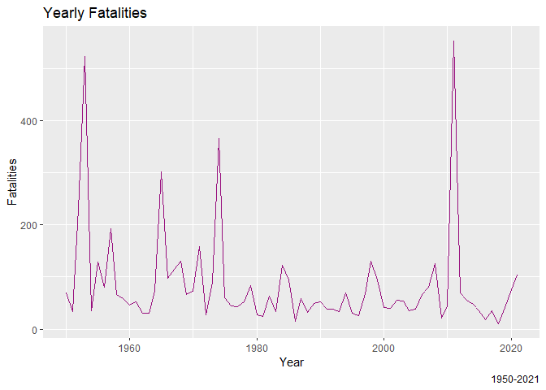
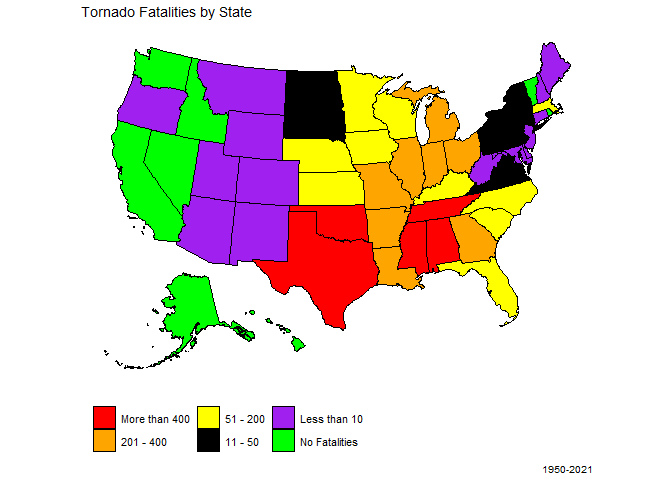
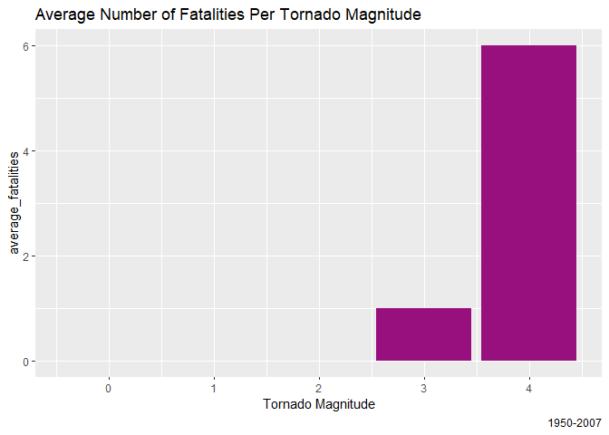
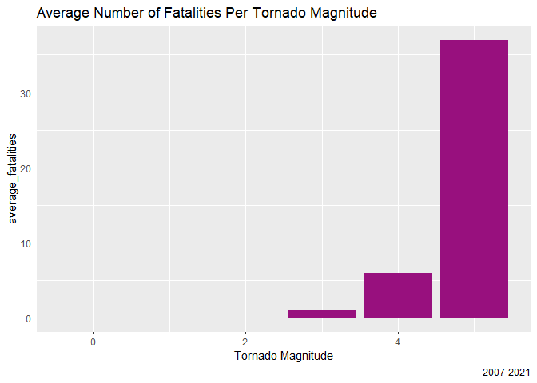

Tornado Project Analysis Report
================
EricMulaa
2023-05-07

``` r
tornado <- read.table(file = "us_tornado_dataset.csv", header = TRUE, sep = ",")
```

``` r
library(tidyverse)
```

    ## ── Attaching core tidyverse packages ──────────────────────── tidyverse 2.0.0 ──
    ## ✔ dplyr     1.1.2     ✔ readr     2.1.4
    ## ✔ forcats   1.0.0     ✔ stringr   1.5.0
    ## ✔ ggplot2   3.4.2     ✔ tibble    3.2.1
    ## ✔ lubridate 1.9.2     ✔ tidyr     1.3.0
    ## ✔ purrr     1.0.1     
    ## ── Conflicts ────────────────────────────────────────── tidyverse_conflicts() ──
    ## ✖ dplyr::filter() masks stats::filter()
    ## ✖ dplyr::lag()    masks stats::lag()
    ## ℹ Use the conflicted package (<http://conflicted.r-lib.org/>) to force all conflicts to become errors

``` r
library(ggplot2)
```

Having a look at the dataset is important for understanding the type of
data I’m dealing with

``` r
head(tornado)
```

    ##     yr mo dy       date st mag inj fat  slat   slon  elat   elon len wid
    ## 1 1950  1  3 1950-01-03 IL   3   3   0 39.10 -89.30 39.12 -89.23 3.6 130
    ## 2 1950  1  3 1950-01-03 MO   3   3   0 38.77 -90.22 38.83 -90.03 9.5 150
    ## 3 1950  1  3 1950-01-03 OH   1   1   0 40.88 -84.58  0.00   0.00 0.1  10
    ## 4 1950  1 13 1950-01-13 AR   3   1   1 34.40 -94.37  0.00   0.00 0.6  17
    ## 5 1950  1 25 1950-01-25 IL   2   0   0 41.17 -87.33  0.00   0.00 0.1 100
    ## 6 1950  1 25 1950-01-25 MO   2   5   0 37.60 -90.68 37.63 -90.65 2.3 300

``` r
str(tornado)
```

    ## 'data.frame':    67558 obs. of  14 variables:
    ##  $ yr  : int  1950 1950 1950 1950 1950 1950 1950 1950 1950 1950 ...
    ##  $ mo  : int  1 1 1 1 1 1 1 2 2 2 ...
    ##  $ dy  : int  3 3 3 13 25 25 26 11 11 11 ...
    ##  $ date: chr  "1950-01-03" "1950-01-03" "1950-01-03" "1950-01-13" ...
    ##  $ st  : chr  "IL" "MO" "OH" "AR" ...
    ##  $ mag : int  3 3 1 3 2 2 2 2 2 2 ...
    ##  $ inj : int  3 3 1 1 0 5 2 0 5 6 ...
    ##  $ fat : int  0 0 0 1 0 0 0 0 0 0 ...
    ##  $ slat: num  39.1 38.8 40.9 34.4 41.2 ...
    ##  $ slon: num  -89.3 -90.2 -84.6 -94.4 -87.3 ...
    ##  $ elat: num  39.1 38.8 0 0 0 ...
    ##  $ elon: num  -89.2 -90 0 0 0 ...
    ##  $ len : num  3.6 9.5 0.1 0.6 0.1 2.3 4.7 9.9 4.6 4.5 ...
    ##  $ wid : int  130 150 10 17 100 300 133 400 100 67 ...

``` r
summary(tornado)
```

    ##        yr             mo               dy            date          
    ##  Min.   :1950   Min.   : 1.000   Min.   : 1.00   Length:67558      
    ##  1st Qu.:1976   1st Qu.: 4.000   1st Qu.: 8.00   Class :character  
    ##  Median :1994   Median : 6.000   Median :16.00   Mode  :character  
    ##  Mean   :1991   Mean   : 5.977   Mean   :15.92                     
    ##  3rd Qu.:2008   3rd Qu.: 7.000   3rd Qu.:24.00                     
    ##  Max.   :2021   Max.   :12.000   Max.   :31.00                     
    ##       st                 mag               inj                fat           
    ##  Length:67558       Min.   :-9.0000   Min.   :   0.000   Min.   :  0.00000  
    ##  Class :character   1st Qu.: 0.0000   1st Qu.:   0.000   1st Qu.:  0.00000  
    ##  Mode  :character   Median : 1.0000   Median :   0.000   Median :  0.00000  
    ##                     Mean   : 0.6913   Mean   :   1.438   Mean   :  0.09047  
    ##                     3rd Qu.: 1.0000   3rd Qu.:   0.000   3rd Qu.:  0.00000  
    ##                     Max.   : 5.0000   Max.   :1740.000   Max.   :158.00000  
    ##       slat            slon              elat            elon        
    ##  Min.   :17.72   Min.   :-163.53   Min.   : 0.00   Min.   :-163.53  
    ##  1st Qu.:33.22   1st Qu.: -98.45   1st Qu.: 0.00   1st Qu.: -94.71  
    ##  Median :37.03   Median : -93.60   Median :32.48   Median : -84.42  
    ##  Mean   :37.14   Mean   : -92.78   Mean   :22.73   Mean   : -56.25  
    ##  3rd Qu.:40.93   3rd Qu.: -86.73   3rd Qu.:38.61   3rd Qu.:   0.00  
    ##  Max.   :61.02   Max.   : -64.72   Max.   :61.02   Max.   :   0.00  
    ##       len               wid        
    ##  Min.   :  0.000   Min.   :   0.0  
    ##  1st Qu.:  0.100   1st Qu.:  20.0  
    ##  Median :  0.800   Median :  50.0  
    ##  Mean   :  3.478   Mean   : 106.6  
    ##  3rd Qu.:  3.130   3rd Qu.: 100.0  
    ##  Max.   :234.700   Max.   :4576.0

There are no NAs in this data

``` r
sum(is.na(tornado))
```

    ## [1] 0

Let’s see the total number of tornadoes that we are dealing with

``` r
tornado %>%
  count() %>%
  print()
```

    ##       n
    ## 1 67558

let’s now see the number of tornadoes group by year

``` r
yearly_tornadoes <- tornado %>%
  group_by(yr) %>%
  count() %>%
  arrange(desc(n))
head(yearly_tornadoes)
```

    ## # A tibble: 6 × 2
    ## # Groups:   yr [6]
    ##      yr     n
    ##   <int> <int>
    ## 1  2004  1817
    ## 2  2011  1691
    ## 3  2008  1689
    ## 4  2019  1517
    ## 5  2017  1428
    ## 6  1998  1424

``` r
tail(yearly_tornadoes)
```

    ## # A tibble: 6 × 2
    ## # Groups:   yr [6]
    ##      yr     n
    ##   <int> <int>
    ## 1  1956   504
    ## 2  1963   463
    ## 3  1953   421
    ## 4  1951   260
    ## 5  1952   240
    ## 6  1950   201

A plot of the same

``` r
ggplot(yearly_tornadoes, aes(x = yr, y = n)) + 
  geom_line(col = "#98107E") + 
  labs(title = "Yearly Tornadoes",
       caption = "1950-2021",
       x = "Year",
       y = "Number of Tornadoes")
```

<!-- -->


From the above data we see that 2004 and the most tornadoes in USA,
followed by 2011, 2008, and then 2019 for the period between 1950-2021,
While 1950 had the least number of recorded tornadoes.

we will now see which month has experienced most tornadoes for period
1950-2021

``` r
monthly_tornadoes <- tornado %>%
  group_by(mo) %>%
  count()
```

I will proceed to visualize this information

``` r
mymonths <- c("Jan","Feb","Mar",
              "Apr","May","Jun",
              "Jul","Aug","Sep",
              "Oct","Nov","Dec")
monthly_tornadoes$abv <- mymonths[ monthly_tornadoes$mo ]
ggplot(monthly_tornadoes, aes(x = abv, y = n)) + 
  geom_col(fill = "#98107E") +
  scale_x_discrete(limits = monthly_tornadoes$abv) +
  labs(title = "Monthly Tornadoes",
       caption = "1950-2021",
       x = "Month",
       y = "Number of Tornadoes")
```

<!-- -->


Most tornadoes have been happening in May. We can see that the number of
tornadoes keep on increasing from January and is at the peak in May,
after which the number of tornadoes start declining.

Let’s see where tornado occurs most in the US

``` r
colnames(tornado)[colnames(tornado) == "st"] <- "state"
states <- tornado %>%
  group_by(state) %>%
  summarise(value = n()) %>%
  arrange(desc(value))
head(states)
```

    ## # A tibble: 6 × 2
    ##   state value
    ##   <chr> <int>
    ## 1 TX     9149
    ## 2 KS     4375
    ## 3 OK     4092
    ## 4 FL     3497
    ## 5 NE     2967
    ## 6 IA     2773

Texas has experience most tornadoes since 1950 to 2021. I will proceed
to visualize the above information

``` r
states <- states %>%
  mutate(color = case_when(value < 500 ~ "Less than 500",
                           value <= 1000 ~ "501 - 1,000",
                           value <= 2000 ~ "1,001 - 2,000",
                           value <= 4000 ~ "2,001 - 4,000",
                           value > 4000 ~ "More than 4,000",
                           TRUE ~ "No Tornadoes"))
```

First, I will arrange the colors

``` r
states$color <- fct_relevel(states$color, c("More than 4,000",
                                                        "2,001 - 4,000",
                                                        "1,001 - 2,000",
                                                        "501 - 1,000",
                                                        "Less than 500"))
```

I will now visualize the values in USA map First, I will load the usmap
package.

``` r
library(usmap)
```

``` r
library(showtext)
```

    ## Loading required package: sysfonts

    ## Loading required package: showtextdb

``` r
plot_usmap(data = states, values = "color", labels = FALSE) +
  scale_fill_manual(values = c( "Less than 500" = "purple",
                                "501 - 1,000" = "black",
                                "1,001 - 2,000"= "yellow",
                                "2,001 - 4,000"= "orange",
                                "More than 4,000" = "red",
                                "No Tornadoes" = "green")) +
  labs(title = "Tornadoes by State",
       caption = "1950 - 2021",
       fill = "color",
       x = "",
       y = "") + theme(legend.position = "bottom",
                       legend.title = element_blank(),
                       legend.text=element_text(size = 8), 
                       axis.ticks = element_blank(),
                       axis.text.x = element_blank(),
                       axis.text.y = element_blank(),
                       axis.title.x=element_blank()) 
```

<!-- -->


From the above map we can see that the most tornado-prone regions in the
US is the central and southeastern states along a corridor sometimes
called “Tornado Alley.”

Let analyze fatalities

``` r
tornado %>%
  summarise(total_fatalities = sum(tornado$fat))
```

    ##   total_fatalities
    ## 1             6112

There has been 6112 fatalities between 1950 and 2021

``` r
yearly_fatalities <- tornado %>%
  group_by(yr) %>%
  summarise(total = sum(fat))
ggplot(yearly_fatalities, aes(x = yr, y = total)) + 
  geom_line(col = "#98107E") + 
  labs(title = "Yearly Fatalities",
       caption = "1950-2021",
       x = "Year",
       y = "Fatalities")
```

<!-- -->


2011 had the most fatalities

Let see fatalities by states

``` r
state_fatalities <- tornado %>%
  group_by(state) %>%
  summarise(value = sum(fat)) %>%
  arrange(desc(value))

state_fatalities <- state_fatalities %>%
mutate(color = case_when(value >= 1 & value <= 10 ~ "Less than 10",
                         value > 10 & value <= 50 ~ "11 - 50",
                         value > 51 & value <= 200 ~ "51 - 200",
                         value > 201 & value <= 400 ~ "201 - 400",
                         value > 400 ~ "More than 400",
                         TRUE ~ "No Fatalities"))
```

I will now arrange the colors

``` r
state_fatalities$color <- fct_relevel(state_fatalities$color, c("More than 400","201 - 400",
                                                          "51 - 200",
                                                          "11 - 50",
                                                          "Less than 10", 
                                                          "No Fatalities"))  
```

``` r
plot_usmap(data = state_fatalities, values = "color", labels = FALSE) +
  scale_fill_manual(values = c( "Less than 10" = "purple",
                                "11 - 50" = "black",
                                "51 - 200"= "yellow",
                                "201 - 400"= "orange",
                                "More than 400" = "red",
                                "No Fatalities"="green")) +
  
  labs(title = "Tornado Fatalities by State",
       caption = "1950-2021",
       fill = "color",
       x = "",
       y = "") + theme(legend.position = "bottom",
                       legend.title = element_blank(),
                       legend.text=element_text(size = 8), 
                       axis.ticks = element_blank(),
                       axis.text.x = element_blank(),
                       axis.text.y = element_blank(),
                       axis.title.x=element_blank())
```

<!-- -->


Alabama had most fatalities, followed by Texas, Mississippi, and
Oklahoma.

We will now see fatalities that were associated with different types of
tornado magnitude. Fatalities of -9 will be filtered out. I will start
by visualizing data from 1950 to 2007 January. Fujita scale was used
during this time.

``` r
mag_f <- tornado %>%
  filter(mag != -9)
  
mag_f <- mag_f %>%
  filter(yr <= 2007 & mo <= 1) %>%
  group_by(mag) %>%
  summarise(average_fatalities = round(mean(fat)), 1)
```

``` r
ggplot(mag_f, aes(y = average_fatalities, x = mag)) + 
  geom_col(fill = "#98107E") + 
  labs(title = "Average Number of Fatalities Per Tornado Magnitude",
       caption = "1950-2007",
       x = "Tornado Magnitude")
```

<!-- -->


It is clear that as tornado magnitude increases, fatalities increase
too.

I will visualize the average number of fatalities as from February 2007.
These were measured using the enhanced Fujita scale which has a slight
differebce from the Fujita scale.

``` r
mag_ef <- tornado %>%
  group_by(mag) %>%
  filter(yr >= 2007 & mo >= 2 & mag != -9) %>%
  summarise(average_fatalities = round(mean(fat)), 1)
ggplot(mag_ef, aes(y = average_fatalities, x = mag)) + 
  geom_col(fill = "#98107E") + 
  labs(title = "Average Number of Fatalities Per Tornado Magnitude",
       caption = "2007-2021",
       x = "Tornado Magnitude")
```

<!-- -->


From the above visual it is clear that lower tornado magnitudes are
associated with lower fatalities and vice verser.
